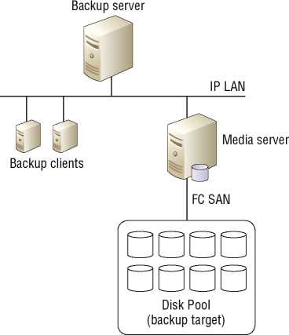
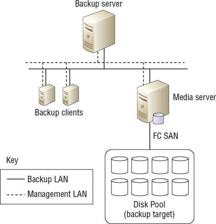
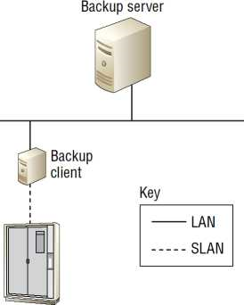
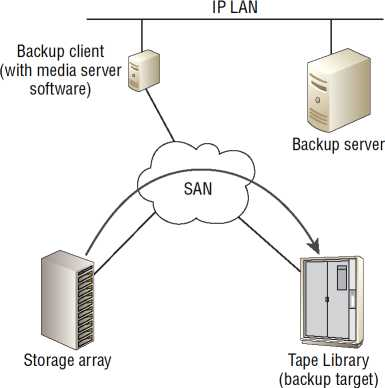
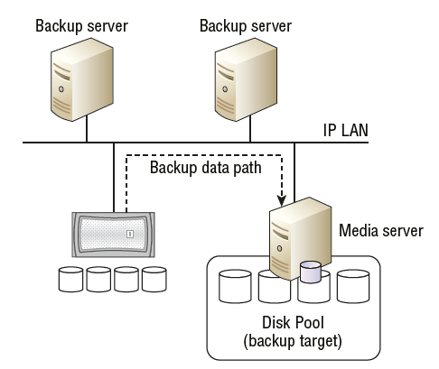
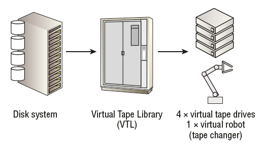
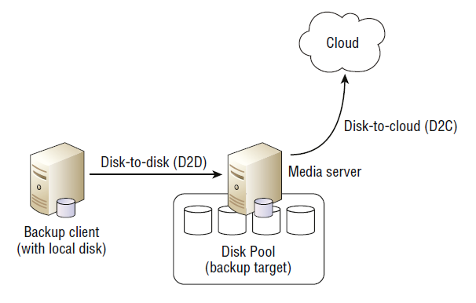

# 1. Обзор
В этой лекции пойдет речь о резервном копировании и восстановлении серверов и приложений. 

***Главная мысль: резервное копирование — это восстановление.***

Если вы делаете резервные копии своих данных каждый день, но не можете восстановить данные из этих резервных копий, ваши резервные копии бесполезны, и вы тратите свое время.

Рассмотрены:
- горячее резервное копирование
- резервное копирование без локальной сети
- какое влияние они оказывают как на производительность сетей, так и на производительность приложений
- способность к восстановлению. 
- типы резервного копирования:
    - полное резервное копирование
    - инкрементальное резервное копирование
    - дифференциальное резервное копирование
    - синтетическое полное резервное копирование
- как каждое из них влияет на восстановление, производительность приложений и сети
- устройства резервного копирования:
    - ленты
    - ленточные накопители
    - виртуальные ленточные библиотеки
    - другие менее распространенные типы носителей резервного копирования (например Blu-ray).
- как технологии оптимизации емкости влияют на производительность резервного копирования, стоимость и потенциальную производительность восстановления.
- архивирование и как оно отличается от резервного копирования, но также дополняет его. 
- технологии, которые отлично подходят для архивирования:
    - адресуемое по содержанию хранилище
    - технологии write once, read many.
# 2. Почему мы делаем резервное копирование

Резервные копии:
- стоят денег
- обременительны в управлении
- могут повлиять на производительность приложений

Зачем мы их делаем?
- данные могут быть повреждены
- случайно удалены

Когда это происходит, резервные копии становятся критически важными для бизнеса.

Утверждения:
- Если бизнес не может вернуться в прежнее состояние после катастрофы, он не может двигаться вперед
- Если резервной копии нет, значит, ее не существует
- Если резервная копия отсутствует хотя бы в двух местах, значит, она не создана

# 3. Резервное копирование и непрерывность бизнеса
***BCP*** (Business Continuity Plan) - план обеспечения непрерывности бизнеса. В нем основные процессы:
- резервное копирование и восстановление
- репликаци
- моментальные снимки (snapshots)

# 4. Цели точки восстановления
***RPO*** (Recovery Point Objectives) - точка восстановления, момент времени, к которому может быть восстановлена служба.

Например, если RPO 24 часа, то это позволит восстановить службу или приложение до состояния, в котором они были не более 24 часов назад. 

RPO являются частью более широкого соглашения об уровне обслуживания ***SLA*** (Service-Level Agreement) между ИТ и бизнесом. 

В контексте ИТ SLA — это форма контракта, описывающая уровни обслуживания, которые ИТ будет предоставлять клиенту. Клиентом обычно является бизнес или бизнес-подразделение, если вы являетесь внутренним ИТ-отделом. 

Например, SLA может определять, что все данные будут ежедневно резервироваться и подлежать восстановлению в течение 6 часов с момента запроса. 

Почти все SLA будут содержать цели точек восстановления.

Когда дело доходит до резервного копирования, цели точек восстановления являются важным фактором. Если бизнес требует RPO в 5 минут для определенного приложения, то ежедневное резервное копирование этой системы не будет соответствовать этому RPO, и вам придется использовать другие технологии, такие как моментальные снимки.

При традиционном резервном копировании на ленту нормальный минимальный RPO составляет один день (24 часа), поскольку обычно нереально делать традиционное резервное копирование на ленту чаще, чем раз в день. Это происходит по двум основным причинам:
- Многие методы резервного копирования влияют на производительность резервируемой системы. Поэтому частое выполнение традиционных резервных копий на ленту может негативно повлиять на производительность резервируемой системы.
- Многие корпоративные системы резервного копирования (медиасерверы, ленточные накопители, сети резервного копирования) уже очень загружены, выполняя всего одну резервную копию в день.

В таких ситуациях, если требуются более детализированные RPO, традиционные резервные копии могут быть дополнены такими технологиями, как ***моментальные снимки***. 

Моментальные снимки могут делаться, например, каждые 15 минут, но храниться только один день. Затем каждая полная традиционная резервная копия на ленту может делаться один раз в день и храниться в течение 12 месяцев. Такая конфигурация позволит восстановить приложение до любой 15-минутной точки в течение последних 24 часов.

Интересно, что в контексте резервного копирования также существует понятие ***удержания***. 

Например, если вы делаете ежедневные резервные копии вашего корпоративного сервера базы данных, храните эти резервные копии в течение 12 месяцев, а затем удаляете их, как только они становятся старше 12 месяцев, вы не сможете восстановить корпоративную систему базы данных до состояния, в котором она была более 12 месяцев назад. 

В этом примере срок хранения резервных копий корпоративной системы базы данных составит 12 месяцев (365 дней). 

Законодательство и нормативные требования могут указывать, что данные из данной системы должны быть доступны для восстановления за последние ***3 года***.

# 5. Цели времени восстановления
***RTO*** (Recovery Time Objectives) - целевое время восстановления, существенно отличается от целевого значения точки восстановления. 

Целевое значение точки восстановления - возможность восстановить систему или приложение до состояния, в котором они были в течение определенного временного окна.

Целевое значение времени восстановления - указывает, сколько времени потребуется, чтобы это сделать. 

Например, может потребоваться 8 часов, чтобы восстановить систему до состояния, в котором она была 24 часа назад.

При определении и принятии решений по RTO обязательно учитывать следующие моменты:
- Время, необходимое для отзыва лент из внешнего хранилища
- Время, необходимое для мобилизации персонала, входа в систему и работы по восстановлению.

Например, если у вас нет сотрудников, работающих в субботу утром, и все ленты находятся вне офиса в безопасном хранилище, вам нужно будет учесть оба этих факта в RTO, чтобы обработать возможность того, что пользователь зарегистрирует запрос в 6 утра в субботу утром на восстановление некоторых данных. Это не так просто, как сказать, что вы можете восстановить x ГБ в минуту, поэтому восстановление y ГБ займет z минут. Есть и другие важные факторы, которые следует учитывать.

# 6. Окно резервного копирования
***Backup Window*** (окно резервного копирования) - это период времени - с началом и концом - в течение которого данные могут быть скопированы.

Например, окно резервного копирования может включать все неосновные рабочие часы для определенного бизнеса, например, с 23:00 до 9:00. В этом случае все резервные копии должны начинаться и завершаться в течение этого временного окна. Однако многие компании имеют разные окна резервного копирования для разных приложений в зависимости от основных рабочих часов для этих приложений.

Основная причина для окна резервного копирования заключается в том, что резервное копирование часто негативно влияет на производительность системы, для которой выполняется резервное копирование, поэтому резервное копирование критической системы в течение основного рабочего дня обычно не является хорошей идеей. При определении окон резервного копирования важно получить информацию от людей, близких к бизнесу.

# 7. Восстановление
Резервные копии предназначены для конкретной цели — иметь возможность восстановить данные после таких событий, как ошибка/удаление пользователя, сбой устройства, логическое повреждение и т. д. Имея это в виду, крайне важно иметь возможность восстановить данные, которые вы резервируете. Резервное копирование данных, если вы не можете их восстановить, бессмысленно и заставит вас выглядеть некомпетентным в глазах ваших клиентов. Таким образом, регулярные репетиции восстановления данных имеют жизненно важное значение. Вы должны регулярно проверять свою способность восстанавливать данные, которые вы скопировали.

# 8. Архитектура резервного копирования
Наиболее распространенные архитектуры резервного копирования основаны на проверенной и испытанной архитектуре клиент-сервер. 

Большинство архитектур резервного копирования состоят из следующих четырех компонентов:
- Резервные серверы ( ***Backup servers*** / ***master server*** / ***cell manager***) - сервер содержит все определения заданий, расписание заданий, базу данных и каталог резервных копий, а также все другие метаданные, относящиеся к резервной среде.
- Резервные клиенты (***Backup clients***) - это программные агенты, которые устанавливаются на серверах, для которых выполняется резервное копирование, и отвечают за перенос данных с клиентской машины, для которой выполняется резервное копирование, на носитель. Агенты резервного копирования, специфичные для приложений, такие как Microsoft Exchange или Microsoft SQL Server, также координируют согласованность приложений при резервном копировании.
- Медиа-серверы (***Media servers***) - подключаются к цели резервного копирования и делают ее доступной для клиентов резервного копирования, чтобы они могли отправлять данные в цель резервного копирования. Например, медиасервер может быть подключен к пулу хранилищ через сеть FC и сделать это хранилище доступным для клиентов резервного копирования через IP LAN.
- Резервное копирование целей (***backup target**) -  варьируются от ленточных накопителей и DVD-дисков до больших пулов дисковых -хранилищ или больших ленточных библиотек. 

Традиционные подходы к резервному копированию продолжают использовать ленту в качестве цели долгосрочного резервного копирования. Более современные подходы, как правило, отдают предпочтение дисковым носителям, включая дисковые пулы, совместно используемые по протоколам на основе локальной сети, таким как SMB/CIFS и NFS, или даже специализированные дисковые массивы, имитирующие ленточные библиотеки, называемые виртуальными ленточными библиотеками. 

Ниже на рисунке показана типичная среда резервного копирования с одним сервером резервного копирования, двумя клиентами резервного копирования, одним медиасервером и дисковым пулом.



Высокоуровневый процесс резервного копирования будет выглядеть следующим образом:
1.	Резервный сервер отслеживает расписание резервного копирования.
2.	Когда расписание указывает, что определенному клиенту требуется резервное копирование, сервер резервного копирования дает команду агентскому программному обеспечению на клиенте резервного копирования выполнить резервное копирование. В рамках этой инструкции сервер резервного копирования сообщает агенту, какие данные следует резервировать и куда их следует сохранять.
3.	Резервный сервер отправляет данные по IP на медиасервер.
4.	Медиасервер направляет входящие данные резервного копирования на целевое устройство резервного копирования через FC SAN, к которому он подключен.

# 9. Методы резервного копирования
Во многих отношениях резервное копирование по-прежнему выглядит так же, как и почти 60 лет назад. Однако методы резервного копирования изменяются и появляются новые.

## 9.1 Горячие резервные копии
В современном мире ИТ почти все резервные копии являются горячими ***Hot Backups*** / ***online backups***. 

Горячие резервные копии идеально подходят для современных требований к ИТ-ресурсам:
- серверы и приложения должны оставаться в рабочем состоянии
- быть в сети в любое время
- минимизация административные издержки
- возможность масштабировать среды резервного копирования (поскольку они не требуют административных остановок и перезапусков приложений, которые необходимо координировать и контролировать только для резервного копирования)

Большинство современных приложений поддерживают горячее резервное копирование: большинство приложений переходят в режим горячего резервного копирования и используют некоторую форму технологии ***PIT*** (point-in-time technology), которая создает замороженный образ данных приложения. Этот замороженный образ затем используется для резервного копирования. 

Довольно часто технологии моментальных снимков ***snapshot***, включая технологии моментальных снимков на основе массивов ***array-based snapshot***, используются как часть процесса создания замороженного образа PIT.

Другим вопросом чрезвычайной важности в мире горячего резервного копирования является возможность выполнять проверки целостности резервных копий. К счастью, большинство хороших приложений, поддерживающих горячее резервное копирование, имеют надежные средства для выполнения контрольных сумм, проверок целостности на уровне приложений и верификации образов резервных копий. Это помогает гарантировать, что резервная копия является хорошей резервной копией и будет полезна в качестве образа для восстановления

## 9.2 Резервное копирование в автономном режиме
Резервное копирование в автономном режиме (***Ofline backups***) - требует, чтобы приложения и базы данных были переведены в автономный режим на время резервного копирования. Это не устраивает современный бизнес.

## 9.3 Резервное копирование по локальной сети
Резервное копирование на основе локальной сети ***LAN-based backups*** - старый, дешевый и удобный метод, но имеет низкую производительность и может повлиять на сетевой трафик.

Работает путем отправки данных резервного копирования по локальной сети, и эта локальная сеть может быть:
- основной производственной сетью 
- сетью, выделенной для резервного трафика. 
    - виртуальные локальные сети (VLAN), где для резервного трафика создается выделенный широковещательный домен L2
    - физически выделенная сеть с собственными сетевыми картами в хостах и сетевых коммутаторах. Стоит дороже, чем простая VLAN, но он обеспечивает лучшую и наиболее предсказуемую производительность, а также является самым простым для устранения неполадок и наименее вероятно, что он негативно повлияет на другой сетевой трафик, не связанный с резервным копированием.



1. Данные, отправляются клиентом по выделенной резервной локальной сети на медиасервер.
2. Медиасервер подключается к резервной цели (***backup target***) через сеть хранения данных ***Fibre Channel (FC SAN)***. 

На рисунке каждый сервер подключен к двум локальным сетям:
- Management LAN - Управление локальной сетью
- Backup LAN - Резервная локальная сеть (предназначенная для резервного трафика)

## 9.4 Резервное копирование без локальной сети (на основе SAN)
Архитектура резервного копирования без локальной сети ***LAN-Free Backups (SAN Based)*** / резервные копиями на основе блоков - резервирует данные без пересечения локальной сети, данные передаются, например, через SAN.

Резервные копии на основе блоков обычно не обеспечивают плавного и простого способа восстановления отдельных файлов. Если вы хотите вернуть отдельный файл, вам может потребоваться восстановить всю резервную копию во временную область, а затем найти нужный файл и скопировать его обратно в исходное местоположение.

По производительности и надежности получаешь то, за что вы платишь:
- FC дороже и производительнее, но
- с появлением сетевых технологий 10G резервное копирование на основе локальной сети также может быть высокопроизводительным, а также и дорогостоящим.

Возможность резервного копирования данных на более высоких скоростях может быть важна в средах, где ***окно резервного копирования является проблемой***. Если вы изо всех сил пытаетесь завершить все ваши резервные копии в рамках выделенного окна резервного копирования, вы можете рассмотреть резервное копирование без локальной сети или, возможно, даже резервное копирование на основе локальной сети через сети Ethernet 10G.



На рисунке показана конфигурация резервного копирования без локальной сети, в которой клиент, для которого выполняется резервное копирование, имеет ***прямое подключение к ленточной библиотеке / СХД на базе SAN***. Для этого клиент, для которого выполняется резервное копирование, обычно должен иметь либо программное обеспечение агента резервного копирования, которое может напрямую взаимодействовать с ленточной библиотекой, либо установленное программное обеспечение сервера резервного копирования.

## 9.5 Резервное копирование без сервера
Резервное копирование без сервера (Serverless Backups***) - это форма резервного копирования без локальной сети и без сервера.

Использует ***SCSI-based EXTENDED COPY** команду , которая позволяет копировать данные напрямую из исходного LUN в целевой LUN. И важное слово здесь — напрямую . 

В конфигурациях резервного копирования без сервера данные отправляются из исходного LUN напрямую в целевой LUN через SAN, но без прохождения через сервер, которому принадлежат данные.

Поскольку резервное копирование без сервера работает с LUN на базе SAN, а ленточные устройства в SAN представлены как LUN, целевые LUN в конфигурации резервного копирования без сервера часто основаны на лентах.

Команда EXTENDED COPY не обязательно должна копировать весь LUN в другой LUN. Она копирует указанные диапазоны блоков из исходного LUN в целевой LUN. Эти диапазоны — блоки, содержащие данные, которые копируются.



1.	***backup server*** сообщает ***backup agent*** размещенному на ***backup client***  о необходимости инициировать безсерверное резервное копирование с указанием ленточной библиотеки в качестве ***target***.
2.	***SCSI EXTENDED COPY*** используется для копирования данных напрямую из массива хранения в ленточную библиотеку через SAN. Ни в какой точке никакие резервные данные не проходят через клиент резервного копирования.
3.	Метаданные о задании передаются по IP LAN на ***backup server***. Эти метаданные включают в себя сведения о задании:
    - время начала, 
    - время завершения, 
    - код завершения и т. д.

Хотя данные, которые копируются, не отправляются по локальной сети, метаданные, касающиеся резервного копирования, все равно отправляются по локальной сети на сервер резервного копирования и клиент/агент резервного копирования. Это делается для того, чтобы метаданные, такие как код завершения задания, время начала, время окончания и т. д., могли храниться на сервере резервного копирования.

Преимущества:
- высокая производительность
- высокая надежность
- снижение негативного влияния на производительность, оказываемого на сервер, для которого выполняется резервное копирование

Недостатки: 
- потенциально более высокой стоимости

## 9.6 NDMP
Network Data Management Protocol (***NDMP***) - это протокол, разработанный для эффективного резервного копирования на базе стандартов NAS.

NDMP похож на резервное копирование без сервера в том, что данные резервного копирования могут быть отправлены напрямую с устройства NAS на устройство резервного копирования без необходимости проходить через ***backup media server***. 

Без NDMP общие файловые ресурсы на основе NAS должны быть смонтированы на ***backup media server***, чтобы иметь возможность резервного копирования. Такая конфигурация будет перетаскивать данные по сети (LAN) с NAS на ***backup media server***, а затем, возможно, обратно по сети на устройство резервного копирования. С NDMP нет необходимости монтировать сетевой ресурс на основе NAS на ***backup media server***. Вместо этого данные могут быть отправлены напрямую с устройства NAS на устройство резервного копирования, затрагивая сеть только один раз. Это снижает объем нагрузки на сеть.

Не связанные с NAS сетевые файловые серверы, такие как серверы Windows и Linux, не обязательно нуждаются в NDMP, поскольку на них может быть установлено программное обеспечение агента резервного копирования, позволяющее им выполнять резервное копирование напрямую на сетевые устройства резервного копирования. Однако, массивы NAS работают под управлением специальных операционных систем, на которых обычно не может быть установлено программное обеспечение агента резервного копирования, и поэтому им нужен протокол, такой как NDMP.

Важной особенностью конфигураций резервного копирования NDMP является ***восстановление с прямым доступом / Direct-access restore (DAR)*** .

Восстановление с прямым доступом обеспечивает следующее:
- Выборочное восстановление файлов (включая восстановление отдельных файлов)
- Более быстрое восстановление

Однако бесплатного обеда не бывает! Побочным эффектом более быстрых и детализированных возможностей восстановления, предоставляемых DAR, является то, что резервное копирование занимает больше времени. Это связано с тем, что при резервном копировании каждого файла его местоположение в резервной копии записывается. Это избавляет вас от необходимости читать или восстанавливать весь образ резервной копии, чтобы найти отдельные файлы или каталоги, которые вы хотите восстановить.


Данные резервного копирования отправляются напрямую с устройства NAS в пул целевых дисков резервного копирования по локальной сети, как показано пунктирной линией.

## 9.7 Проблема маленьких файлов
Резервное копирование большого количества маленьких файлов может быть настоящим убийцей — и не только для NDMP. 

Например, резервное копирование 1 000 000 файлов по 1 КБ займет гораздо больше времени, чем резервное копирование одного файла размером 1 000 000 КБ (около 100 МБ). Намного больше! 

Одна из причин заключается в том, что каждый отдельный файл должен быть каталогизирован, а в некоторых решениях для резервного копирования — проверен. Это похоже на разницу между покраской одной большой плоской стены и покраской той же поверхности, но на множестве меньших стен. С большой стеной у вас есть только один набор углов и краев для покраски, тогда как покраска множества меньших стен значительно увеличивает количество углов и краев, которые вам нужно покрасить. Если у вас большие файловые ¬системы с миллионами или миллиардами файлов и небольшое окно резервного копирования, в которое вы с трудом втиснули свои резервные копии, то решение для резервного копирования на основе блоков, ¬такое как резервное копирование без сервера, может быть лучшим вариантом. Однако ¬резервное копирование на основе блоков, как правило, не позволяет вам легко восстанавливать отдельные файлы.

# 10. Типы резервного копирования
## 10.1 Полные резервные копии (Full Backups)
Полные резервные копии копируют все. Они начинаются сверху и не заканчиваются, пока не дойдут до самого низа. Ассоциация индустрии сетей хранения данных (***SNIA***) определяет полные ***резервные копии как «резервную копию, в которой копируются все объекты определенного набора данных, независимо от того, были ли они изменены с момента последнего резервного копирования»***.

- Преимущества:
    - предлагают лучшее с точки зрения скорости восстановления и простоты восстановления.
    Например, если мы делаем резервную копию всего домашнего диска с 250 ГБ данных на нем каждую ночь и хотим восстановить содержимое нашего домашнего диска за шесть дней, нам, вероятно, понадобится только одна лента для выполнения восстановления. Процесс потребует идентификации ленты, загрузки ее в ленточный накопитель, а затем восстановления данных с ленты.
- Недостатки:
    - занимают больше всего места на целевом устройстве резервного копирования
    - занимают бОльшую часть пропускной способности сети
    - занимают бОльшую часть ресурсов сервера. 
    - занимают больше всего времени. 
    
Используя предыдущий пример резервного копирования нашего домашнего диска каждую ночь, это означает, что каждую ночь мы извлекаем 250 ГБ данных резервной копии по сети и сохраняем их на нашем устройстве резервного копирования. Хотя это может показаться не таким уж большим объемом данных, это может быстро стать большим объемом данных, когда вы поймете, что вашей организации нужно каждую ночь резервировать 100, 500 или более 1000 домашних дисков. Это также требует, чтобы весь наш домашний каталог был прочитан как часть процесса резервного копирования, что создает дополнительную нагрузку чтения на хост и массив хранения, на котором размещен домашний диск. Так что не все так хорошо, когда дело доходит до полного резервного копирования.

### Примечание: Обратите внимание на значение слова «инкрементный»!
В общем использовании и в соответствии с практически каждым коммерческим инструментом резервного копирования инкрементальное резервное копирование определяется как задание, которое создает резервные копии файлов, зависших с момента последнего резервного копирования... и это «последнее резервное копирование» может быть инкрементальным резервным копированием или полным резервным копированием. Это означает, что для полного восстановления требуется самая последняя полная резервная копия плюс все инкрементальные резервные копии с момента полного резервного копирования.

***SNIA***(https://www.snia.org/) определяет инкрементальные резервные копии (***cumulative incremental backup***):
```
A backup in which all data objects modified since the last full backup are retained as the backup.
To restore data when cumulative incremental backups are in use, only the latest full backup and the
latest cumulative incremental backup are required.
```
Резервная копия, в которой все объекты данных, измененные с момента последней полной резервной копии, сохраняются в качестве резервной копии. Для восстановления данных при использовании накопительных инкрементных резервных копий требуются только последняя полная резервная копия и ***последняя*** накопительная инкрементная резервная копия.

***ПРАВИЛЬНО:***
что для полного восстановления требуется самая последняя полная резервная копия плюс ***все*** инкрементальные резервные копии ¬с момента полного резервного копирования.

## 10.2 Накопительные инкрементальные резервные копии (Cumulative Incremental Backups)
Кумулятивное инкрементальное резервное копирование — это термин SNIA для того, что обычно называют дифференциальным резервным копированием — отличается от полного резервного копирования, но работает вместе с ним. 

Различия:
- кумулятивное инкрементальное резервное копирование резервирует только те данные, которые изменились с момента последнего полного резервного копирования.
- полные - все

*** Итак, в первую очередь вам нужна полная резервная копия, а с этого момента вы можете делать кумулятивные инкрементальные резервные копии.***

Большинство решений для кумулятивного инкрементного резервного копирования создадут резервную копию всего файла, даже если с момента последнего резервного копирования изменился только один байт файла. 

Давайте рассмотрим пример на основе нашего домашнего диска объемом 250 ГБ. Предположим, что у нас есть расписание резервного копирования, которое выполняет полное резервное копирование нашего домашнего диска каждую пятницу вечером, а затем выполняет кумулятивное инкрементное резервное копирование через день недели. 
- В пятницу мы перетащим 250 ГБ по сети и сохраним их на нашем устройстве резервного копирования. 
- В субботу мы перетащим по сети и сохраним на нашем устройстве резервного копирования только файлы, которые были обновлены с момента полного резервного копирования в пятницу вечером — вероятно, не очень много данных вообще. 
- То же самое касается каждого второго резервного копирования перед следующим полным резервным копированием в пятницу вечером; 

Каждое кумулятивное инкрементное резервное копирование создает резервную копию только данных, которые изменились с момента полного резервного копирования в предыдущую пятницу. И если мы не будем ежедневно менять много данных на нашем домашнем диске, эта комбинация полного и кумулятивного инкрементного резервного копирования сэкономит нам массу места для хранения резервных копий и пропускной способности сети.

***Недостаток:***
Допустим, сегодня четверг, и мы удалили все содержимое нашего домашнего диска и нам нужно восстановить его из последней резервной копии. Последняя резервная копия была сделана в среду вечером, но резервная копия в среду вечером была только кумулятивной инкрементальной ¬резервной копией, поэтому она содержит только данные, которые изменились с момента полного резервного копирования в прошлую пятницу. Таким образом, чтобы восстановить все содержимое нашего домашнего каталога, нам нужны ленты из полной резервной копии в пятницу вечером, а также лента из кумулятивной инкрементальной ¬резервной копии в среду вечером. 

Затем наше программное обеспечение для резервного копирования должно координировать процесс, чтобы то, что будет восстановлено, было образом нашего домашнего диска, каким он был в среду вечером.
Это немного сложнее, чем делать полную резервную копию каждую ночь, но когда дело доходит до резервного копирования файловой системы, большинство организаций приходят к выводу, что преимущества использования кумулятивного инкрементного -резервного копирования в течение недели намного перевешивают недостатки.

## 10.3 Дифференциальные инкрементальные резервные копии (Differential Incremental Backups)
По SNIA:
```
A backup in which data objects modified since the last full backup or incremental backup are copied.
To restore data when differential incremental backups are in use, the newest full backup and all differential backups newer than the newest full backup are required. See cumulative incremental backup, full backup.
```
Резервная копия, в которую копируются объекты данных, измененные с момента последней полной или инкрементальной резервной копии.
Для восстановления данных при использовании дифференциальных инкрементальных резервных копий требуются новейшая полная резервная копия и все дифференциальные резервные копии, более новые, чем новейшая полная резервная копия. См. накопительное инкрементное резервное копирование, полное резервное копирование.

Преимущество:
- подходит для экономии пространства, так как каждое дифференциальное инкрементальное резервное копирование должно будет отправлять еще меньше данных по сети на наше устройство резервного копирования, чем кумулятивное инкрементальное резервное копирование. 
- меньше нагрузки на сеть 
- меньше нагрузки на хост

Недостаток:
- является самым медленным и сложным с точки зрения операций восстановления.

### Пример
Допустим, снова четверг, и мы снова удалили все содержимое нашего домашнего диска и нам нужно восстановить его из последней резервной копии. Последняя резервная копия была сделана в среду вечером. Но на этот раз это была дифференциальная инкрементная резервная копия, то есть она содержит только данные, которые изменились с момента дифференциальной инкрементной резервной копии предыдущей ночью (вторника вечером). И резервная копия во вторник вечером также была дифференциальной инкрементной резервной копией, то есть она содержит только данные, которые изменились с момента резервной копии в понедельник вечером. И резервная копия в понедельник вечером также была дифференциальной инкрементной резервной копией. Надеюсь, вы поняли. В конечном итоге, чтобы восстановить все содержимое нашего домашнего каталога, нам нужны ленты из полной резервной копии в пятницу вечером, а также все ленты из каждой последующей дифференциальной инкрементной резервной копии — в субботу, воскресенье, понедельник, вторник и среду! И снова, затем программное обеспечение для резервного копирования должно координировать процесс так, чтобы то, что будет восстановлено, было образом нашего домашнего диска, каким он был в среду вечером.

Это намного сложнее, чем даже полные и кумулятивные инкрементные резервные копии. Однако это более эффективно с точки зрения пространства и меньше нагрузки на сеть и хост.

## 10.4 Синтетические полные резервные копии (Synthetic Full Backups)
Более новая форма резервного копирования.

На высоком уровне синтетическая полная резервная копия работает, делая однократную полную резервную копию, а затем с этого момента делая только инкрементальные или дифференциальные резервные копии. 

И по этой причине вы можете услышать, что синтетические полные резервные копии называют формой системы инкрементального вечного резервного копирования. 

Вместо того, чтобы просто делать инкрементальные резервные копии вечно и всегда возвращаться к исходной полной резервной копии плюс последней дифференциальной инкрементальной, периодически создается синтетическая полная резервная копия. И синтетическая полная резервная копия выглядит, ощущается и работает точно так же, как обычная полная резервная копия, только она не создается путем перебора каждого файла на нашем домашнем диске, повторной передачи каждого из них по сети и повторного сохранения каждого из них на нашем устройстве резервного копирования.

### Пример
 Предположим, мы решили развернуть синтетический полный подход к резервному копированию нашего домашнего каталога. В первую пятницу мы выполняем традиционное полное резервное копирование. Мы считываем все 250 ГБ данных, загружаем их по сети и сохраняем как один полный образ резервной копии на нашем устройстве резервного копирования. Отлично. Каждую последующую ночь мы выполняем ¬инкрементальное резервное копирование, чтобы загружаем только измененные данные по сети и сохраняем их на нашем устройстве резервного копирования. Затем, когда наступает следующая пятница, вместо выполнения еще одного традиционного полного резервного копирования со всеми связанными с этим накладными расходами мы берем образ полной резервной копии прошлой пятницы, берем обновленный инкрементальный, а затем объединяем предыдущую полную резервную копию с только что сделанной нами инкрементальной резервной копией. И в итоге мы получаем образ резервной копии, который в точности соответствует традиционному полному резервному копированию, только нам не нужно считывать каждый файл с нашего домашнего диска и загружать его по сети. 
 
 И что немаловажно, этот синтетический полный резервный бэкап затем можно использовать в качестве основы для еще одной недели инкрементальных резервных копий.

Однако способ создания синтетических полных резервных копий может создавать дополнительную нагрузку на устройство резервного копирования, поскольку программное обеспечение для резервного копирования должно считывать все содержимое последней полной резервной копии с устройства резервного копирования, в то время как устройство резервного копирования одновременно записывает новый образ синтетической полной резервной копии. ***Это чтение и запись могут быть очень тяжелой работой для устройства резервного копирования.***

## 10.5 Резервное копирование с учетом приложений (Application-Aware Backups)
Резервное копирование с учетом приложений ***Application-Aware Backups*** (иногда называемое резервным копированием с согласованием с приложениями ***application-consistent backups*** ) представляет собой разновидность горячего резервного копирования и имеет решающее значение, если вы хотите иметь возможность восстанавливать приложения из резервных копий.

Одно дело резервировать стандартные данные файловой системы, такие как домашние диски и общие папки, как плоские файлы. Но если вы попытаетесь сделать резервную копию баз данных или приложений, таких как Microsoft Exchange, как плоские файлы, ***не координируя резервное копирование с приложением, вы почти наверняка не сможете восстановить свое приложение из резервных копий!***

Резервное копирование с поддержкой приложений обычно требует установки специального агентского программного обеспечения на сервере приложений, например, установки агента Exchange Server на сервере Exchange. Этот агент выполняет обычную работу по взаимодействию с сервером резервного копирования и отправке данных на устройство резервного копирования, но он также обеспечивает интеллект, необходимый для резервного копирования приложения в согласованном состоянии.

### Пример
Одна компания пережила значительный рост и искала варианты сокращения сетевой пропускной способности, потребляемой трафиком резервного копирования. Поскольку они начинали как небольшая компания, их проект резервного копирования на основе локальной сети не имел выделенной резервной локальной сети. Они хотели реализовать синтетические полные резервные копии.
Однако их целевыми устройствами резервного копирования были дисковые устройства дедупликации. На этапе тестирования, перед развертыванием синтетических полных резервных копий, они заметили, что производительность резервного копирования существенно снижалась при создании синтетических полных образов. При более внимательном рассмотрении было выяснено, что способ создания синтетических полных образов резервного копирования создавал шаблон рабочей нагрузки, с которым устройства резервного копирования с дедупликацией не могли справиться; интенсивное чтение и запись одновременно достаточно плохи для дисковой системы хранения, но усугубляются, когда в дело вступает дедупликация. Это связано с тем, что когда данные считываются обратно с устройства дедупликации, их необходимо регидратировать (не дедуплицировать), что значительно увеличивает загрузку диска, которая уже имела место. Конечным результатом в этом случае был возврат к традиционным полным резервным копиям и рассмотрение внедрения резервной локальной сети.

## 10.6 Служба теневого копирования томов Microsoft
Многие приложения предоставляют механизм для резервного копирования как в горячем, так и в согласованном состоянии. В мире Microsoft служба теневого копирования томов (VSS) — это технология, которая позволяет создавать резервные копии приложений Microsoft в этом горячем и согласованном состоянии. Аналогичные возможности существуют для некоторых не-Microsoft-опций, таких как RMAN для Oracle. Однако, поскольку VSS так популярен и хорошо известен, давайте кратко рассмотрим, как он работает.

В пространстве Microsoft VSS программное обеспечение для резервного копирования, которое в терминологии VSS называется запросчиком ***requestor***, сообщает службе VSS, работающей на сервере, что она хочет создать резервную копию приложения на этом сервере. 

Например, если намерение состоит в том, чтобы создать резервную копию Microsoft SQL Server:

1. программное обеспечение для резервного копирования (запросчик VSS) сообщит VSS на машине, на которой запущен SQL Server, что она хочет создать резервную копию SQL Server. 

2. Затем VSS сообщает приложению (SQL Server) о необходимости подготовиться к горячему резервному копированию. 

3. Приложение делает это, завершая текущий ввод-вывод, очищая локальные буферы, применяя журналы и устанавливая все флаги приложения, необходимые для плавного восстановления. 

4. Затем приложение сообщает о своем состоянии обратно в VSS. 

5. Затем VSS дает приложению указание приостановить работу (заморозить ввод-вывод приложения), пока создается снимок. 

6. После создания снимка VSS дает указание приложению (SQL Server) возобновить работу. 

7. Все вводы-выводы приложения, которые были заморожены во время приостановки, завершаются, и возобновляются обычные операции. 

8. Затем резервная копия создается на основе моментального снимка, созданного VSS. 

Важно понимать, что даже во время периода затишья, пока приложение остается работающим и обслуживает запросы пользователей, замороженный ввод-вывод приложения все еще происходит, но не фиксируется на диске до окончания периода затишья. Период затишья обычно длится всего несколько секунд, пока делается моментальный снимок.

Конечным результатом является резервная копия, согласованная с приложением, которая гарантированно будет жизнеспособной в качестве варианта восстановления, которая была сделана, когда приложение было в сети и работало. Ни один пользователь или клиент приложения не будет знать, что приложение было просто переведено в режим горячего резервного копирования и была сделана резервная копия.

# 11. Резервные копии целевых объектов и устройств
Все резервные копии должны где-то храниться. Технически говоря, мы называем место назначения резервных копий целями резервного копирования, хотя иногда мы используем термин устройство резервного копирования.

Раньше резервные копии почти всегда были на основе лент, с использованием таких технологий, как ленточные накопители и ленточные библиотеки. Однако в настоящее время существует множество вариантов, включая, но не ограничиваясь, следующими:
- Ленточные устройства
- Виртуальные ленточные библиотеки
- Пулы дисков
- Облачные сервисы

## 11.1 Резервное копирование на ленту
Резервное копирование на ленту (иногда называемое SNIA ***B2T***) — вероятно, самая старая и наиболее распространенная форма резервного копирования

### 11.1.1 Преимущества ленты
Резервное копирование на ленту заключается в резервном копировании данных на линейные ленточные устройства. Хотя лента может показаться очень древней технологией, современные ленточные накопители и ленточные библиотеки имеют много положительных особенностей, включая следующие:
- Высокая вместимость
- Высокая последовательная производительность
- Низкая мощность
Что касается производительности, то природа ленты почти идеально подходит для требований к производительности резервного копирования. Типичная рабочая нагрузка задания резервного копирования — это потоковая передача последовательных данных, и ленты процветают при последовательных рабочих нагрузках. 

Однако ленты отвратительно работают с произвольной производительностью. Но произвольная производительность не является главным требованием в большинстве решений для резервного копирования.

### 11.1.2 Недостатки ленты
У ленты как носителя резервного копирования есть и некоторые недостатки:
- Деградация носителя
- Обновление технологий
- Неудобно для некоторых типов восстановления

Как форма магнитного носителя информации, ленты со временем подвержены деградации, особенно если они не хранятся в оптимальных условиях — с контролем тепла, влажности и т.д. Хранение лент в таких идеальных условиях стоит денег. Безопасное хранение лент вне офиса, иногда называемое хранилищем , может быть еще более дорогостоящим.

Также существует опасение, что когда через 10 лет вам придется восстанавливать данные с лент, даже если вы хранили ленты в оптимальных условиях, у вас больше не будет ленточных накопителей или программного обеспечения, которое сможет их прочитать.

Кроме того, ленты отлично подходят для восстановления данных из полных резервных копий, но если вам нужно выполнить восстановление на основе дифференциальных резервных копий, они могут быть громоздкими. Например, загрузка и выгрузка нескольких лент неудобна, как и быстрая перемотка вперед и назад по катушке ленты, чтобы найти нужное место на катушке, где хранятся нужные вам данные.

Из-за этих опасений, а также из-за снижения стоимости вращающихся дисковых носителей многие люди начинают отказываться от ленты для резервного копирования. Тем не менее, она по-прежнему популярна, и рынок для ленты все еще существует.

### 11.1.3 Технология LTO
Доступны все виды ленточных технологий, каждая из которых требует определенного типа ленточного накопителя, а иногда и библиотеки. Однако самым популярным форматом ленты в пространстве открытых систем является формат Linear Tape-Open (LTO).
В стандартах LTO существуют различные версии лент LTO, каждая из которых обозначена номером. Текущие версии LTO включают LTO-1, LTO-2, LTO-3, LTO-4, LTO-5 и LTO-6.
Согласно стандартам LTO, их характеристики производительности, емкости и другие характеристики приведены в таблице

| Функции                                                   |  LTO-1  |  LTO-2  |  LTO-3  |  LTO-4  |  LTO-5  |  LTO-6  |
| --------------------------------------------------------- | ------- | ------- | ------- | ------- | ------- | ------- |
| Несжатая емкость ***Uncompressed capacity***              |  100 ГБ | 200 ГБ  | 400 ГБ  |  800 ГБ | 1.5 TБ  | 2.5 TБ  |
| Сжатая емкость ***Compressed capacity***                  | 200 ГБ  | 400 ГБ  | 800 ГБ  |	1,6 ТБ  | 3 ТБ    | 6,25 ТБ |
| Скорость без сжатия (МБ/с) ***Uncompressed speed (MBps)***|   20	  |   40    |	80	  |   120   |  140    |  160    |
| Скорость со сжатием (МБ/с)***Compressed speed (MBps)***   |   40    |   80    |   160   |   240   |  280    |  400    |
| Степень сжатия ***Compression ratio***                    |   2:1   |   2:1   |   2:1   |   2:1   |  2:1    |  2.5:1  |
| Шифрование ***Encryption***                               |   Нет   |   Нет   |   Нет   |    Да   |   Да    |    Да   |
| WORM                                                      |   Нет   |   Нет   |   Да    |    Да   |   Да    |    Да   |

WORM (Write Once, Read Many) в контексте LTO (Linear Tape-Open) означает, что данные на ленте можно записать только один раз, но прочитать их можно множество раз. Это обеспечивает неизменность и безопасность данных, поскольку записанные данные не могут быть изменены или удалены.

Стандарты LTO также предписывают следующую обратную совместимость между накопителями и носителями:
- Накопитель LTO сможет считывать данные с лент своего поколения, а также двух предыдущих поколений.
- Накопитель LTO сможет записывать данные на ленты своего поколения, а также поколения, непосредственно предшествующего ему.

### 11.1.4 Чистка обуви
Чистка обуви — это явление в мире резервного копирования на ленту, которое происходит, когда скорость, с которой данные отправляются на ленточный накопитель, не соответствует скорости работы ленточного накопителя. Когда это происходит, ленточный накопитель должен время от времени замедляться или на мгновение останавливаться, пока данные, поступающие с медиа-сервера, снова накапливаются. Этот запуск и остановка катушки с лентой или замедление и последующее ускорение ленты немного напоминает движение вперед-назад при чистке обуви тряпкой. В то время как периодическая чистка обуви замедляет задания по резервному копированию, чрезмерная чистка обуви может привести к преждевременному износу картриджа с лентой, головок и двигателя ленточного накопителя.

### 11.1.5 Мультиплексирование
Мультиплексирование отправляет данные из нескольких заданий резервного копирования на один ленточный накопитель. Цель состоит в том, чтобы увеличить скорость отправки данных на ленточный накопитель, позволяя ленточному накопителю работать на максимальной скорости. Это отлично помогает избежать чистки обуви.
Однако мультиплексирование может повлиять на производительность восстановления. Это происходит потому, что несколько потоков данных, которые были мультиплексированы на один и тот же ленточный накопитель, чередуются друг с другом. Когда вы восстанавливаете данные из одного из заданий (одного из потоков), все данные из всех мультиплексированных заданий должны быть считаны, а данные из заданий, которые вы не восстанавливаете, должны быть отброшены, что снижает общую производительность накопителя и операции восстановления.
Как правило, мультиплексирование позволяет быстрее создавать резервные копии, но медленнее восстанавливать данные. При рассмотрении возможности развертывания мультиплексирования необходимо взвесить недостатки более медленного восстановления и преимущества выполнения нескольких заданий по резервному копированию.

### 11.1.6 Сжатие ленты
Большинство технологий ленточных накопителей, включая LTO, поддерживают собственное сжатие. Спецификация LTO использует форму сжатия, известную как потоковое сжатие данных без потерь (***Streaming Lossless Data Compression (SLDC)***). Хотя SLDC не является самым эффективным алгоритмом сжатия из доступных, он быстр и признан хорошим балансом между хорошим сжатием и хорошей производительностью.

***Попытка сжать зашифрованные данные*** может привести к тому, что набор данных станет больше, чем был до попытки сжатия. К счастью, большинство технологий резервного копирования, которые шифруют данные перед отправкой на ленту, помечают их как зашифрованные, чтобы не предпринимать попыток их сжать.

### 11.1.7 Шифрование ленты
***Убедитесь, что вы шифруете свои ленты!***

Стандарты LTO определяют ленточные накопители с возможностью шифрования, начиная с LTO-4, но они не требуют, чтобы все накопители LTO-4 поддерживали шифрование. Поэтому обязательно проверяйте спецификации любых новых ленточных накопителей LTO, которые вы покупаете, если вы планируете использовать шифрование на основе ленточных накопителей.

Алгоритм шифрования, используемый LTO, представляет собой симметричный блочный шифр (***256-битный AES-GCM***), который использует один и тот же ключ для шифрования и дешифрования данных. 

А при шифровании на основе дисков LTO для управления ключами потребуется сторонний менеджер ключей. К счастью, большинство хороших приложений для резервного копирования выполняют задачу управления ключами.

Что касается производительности, большинство хороших дисков смогут выполнять шифрование на полной скорости линии внутри диска.

***Поскольку зашифрованные данные невозможно сжать, шифрование следует выполнять после сжатия данных, что и происходит при шифровании на основе дисков LTO.***

### 11.1.8 Виртуальная ленточная библиотека
***Virtual tape library (VTL)*** - стала первым важным шагом от ленточных резервных копий к дисковым резервным копиям, и она проложила путь для более нативных подходов к резервному копированию данных на дисковые резервные копии.

На момент появления VTL многие компании уже имели устоявшиеся практики, процедуры и политики в отношении работы с лентой в качестве резервного носителя. В этих случаях технологии VTL помогли этим компаниям начать использовать резервные копии на основе дисков без необходимости менять все свои существующие процессы и практики.

Сегодня почти каждое приложение резервного копирования на планете поддерживает собственное резервное копирование на диск без необходимости эмуляции ленты (VTL). 

Фактически, большинство современных приложений резервного копирования имеют более надежные опции резервного копирования на диск, чем резервного копирования на ленту, а некоторые приложения резервного копирования даже не поддерживают резервное копирование на ленту!

На высоком уровне технологии VTL берут дисковые массивы хранения и разделяют их так, чтобы они выглядели как ленточные библиотеки и ленточные накопители — отсюда и название виртуальная ленточная библиотека.

Первоначальное требование для этой виртуализации — позволить существующему программному обеспечению резервного копирования выполнять резервное копирование на целевой дисковый накопитель без необходимости его модификации для понимания дисковых пулов — по сути, беря целевой дисковый накопитель и заставляя его выглядеть и работать точно так же, как ленточная библиотека, чтобы существующее программное обеспечение резервного копирования могло с ним взаимодействовать.
На рисунке показан дисковый массив, виртуализированный в VTL, сконфигурированную с четырьмя виртуальными ленточными накопителями и одним роботом.



Строго говоря, технология VTL не является настоящей технологией резервного копирования на диск (B2D). Основная причина в том, что она берет дисковую систему и делает ее похожей на старомодную ленточную библиотеку. Это диск, притворяющийся лентой, поэтому не может быть строго квалифицирована как резервное копирование на диск.

Одной из важных технологий, которую решения ***VTL стали пионерами дедупликации данных***. Хотя эта функция не ограничивается только технологией VTL, решения ***VTL почти всегда выполняют собственную дедупликацию***. 

Для этого есть две основные причины:
1. Рабочие нагрузки резервного копирования идеально подходят для дедупликации. Мы снова и снова делаем резервные копии одних и тех же наборов данных, и часто большая часть данных не изменилась и поэтому будет очень хорошо дедуплицироваться. 
2. Чтобы быть конкурентоспособными по цене с традиционными ленточными библиотеками, системам VTL на основе дисков требовалась технология, которая позволяла бы им хранить больше данных на меньших площадях.

# 11.2 Резервное копирование на диск
Резервное копирование на диск ***backup-to-disk (B2D) / disk-to-disk (D2D)*** 
похоже на резервное копирование на ленту (B2T), но целевым носителем является диск, а не лента. У диска есть несколько преимуществ перед лентой:
- Превосходный произвольный доступ
- Превосходные одновременные операции чтения и записи
- Лучшая надежность

Хотя произвольный доступ не всегда рассматривается как решающее соображение производительности в отношении резервного копирования (в конце концов, многие рабочие нагрузки резервного копирования в значительной степени последовательны), все равно могут быть преимущества в наличии хорошей произвольной производительности. 

Одним из таких преимуществ является восстановление небольших файлов (что является одним из наиболее распространенных типов операций восстановления). При восстановлении на основе диска система может почти немедленно найти требуемые данные и начать восстановление. 

В системах на основе ленты требуется время, чтобы загрузить ленту, а затем быстро перемотать ее вперед или назад в нужное место.

Дисковые системы также намного превосходят в одновременных операциях чтения и записи. Это ***может быть полезно при создании синтетических полных резервных копий***, когда система одновременно читает и пишет во время создания синтетического полного резервного образа (читает последнюю полную резервную копию и требуемые инкрементные, одновременно записывая синтетический полный образ).

Другое место, где это может помочь, — это ***одновременные операции резервного копирования (записи) и восстановления (чтения)***, хотя, справедливости ради, нечасто приходится одновременно выполнять резервное копирование и восстановление с одной и той же ленты. 

Однако, если у вас не так много ленточных накопителей, вам может понадобиться выгрузить ленту, на которую вы делали резервную копию, чтобы загрузить ленту, с которой нужно восстановить данные. 

Целевые объекты резервного копирования на основе дисков с их превосходной производительностью одновременного чтения и записи помогут вам в этом.

Вообще говоря, резервное копирование на диск часто может предложить ***более быстрое время восстановления***. Например, не нужно ждать, пока ленты будут загружены и перемотаны на место. Кроме того, собственная последовательная производительность некоторых ленточных накопителей может быть подорвана мультиплексным резервным копированием, что означает, что восстановление на основе ленты не всегда так быстро, как могло бы быть.

***Резервные копии на основе дисков предлагают более надежный носитель резервного копирования, чем ленты***. Это основано на том факте, что, хотя диски и ленты подвержены сбоям, ***дисковые массивы почти всегда защищены технологиями RAID***. 

В конечном итоге, когда диски выходят из строя в дисковой системе, данные не теряются. Ленты, с другой стороны, редко, если вообще когда-либо, защищены, поскольку задания резервного копирования редко дублируются на нескольких лентах для обслуживания сценариев сбоя ленты.

Важным соображением при выполнении резервного копирования на диск является то, что программное обеспечение для резервного копирования должно понимать цели резервного копирования на основе дисков, такие как дисковые пулы, поскольку они существенно отличаются от ленточных накопителей и ленточных картриджей. Во-первых, не существует концепции ленточных картриджей (tape cartridges), скретч-пулов (scratch pools), штрих-кодов (bar codes) и других аспектов, связанных с лентами. Однако все хорошие современные приложения для резервного копирования имеют обширную поддержку целей резервного копирования на основе дисков.

Резервное копирование на диск обычно выполняется через IP-сети и обеспечивает интерфейс файловой системы, такой как ***NFS*** и ***SMB/CIFS***, для дискового пула. Он также позволяет нескольким операциям резервного копирования и восстановления одновременно получать доступ к дисковому пулу.

В большинстве сред использование резервного копирования на диск не означает конец ленты. ***Фактически резервное копирование на диск используется для дополнения существующих решений резервного копирования на основе ленты, значительно улучшая их.*** 

Распространенный подход заключается в том, чтобы размещать резервные копии на диске, а затем в конечном итоге копировать их на ленту, в схеме, часто называемой ***«диск-диск-лента» disk-to-disk-to-tape (D2D2T)***. 

Резервные копии создаются на дисковых целевых объектах и хранятся там около недели. 

В течение этого времени они, скорее всего, потребуются для операций восстановления, и поскольку они находятся на диске, они могут обеспечить отличное время восстановления.

По истечении этого периода задания переносятся на ленту, откуда они затем переносятся за пределы площадки и хранятся для долгосрочного хранения. Одним из недостатков этого подхода является необходимость в дополнительном задании копирования для копирования образов резервных копий с дискового целевого объекта на ленточный целевой объект.

# 11.3 Резервное копирование в облако
С облаком вы обычно пользуетесь услугами (***services***) и платите на основе того, сколько вы используете услугу. Эту коммерческую модель часто называют моделью потребления ***consumption model*** или биллингом на основе потребления ***consumption-based billing***. Вы также можете быстро и легко увеличивать или уменьшать объем потребляемой вами услуги с помощью облака.
Для резервного копирования и восстановления облако интересно как цель резервного копирования. В каком-то смысле оно почти идеально, так как вам не нужен быстрый или частый доступ к вашим резервным копиям после того, как они сохранены в облаке.

Однако большой вопрос заключается в том, как вы переносите свои резервные копии данных в облако. 
 
 Распространенным подходом является развертывание архитектуры ***«диск-диск-облако» isk-to-disk-to-cloud (D2D2C)***. Это похоже на «диск-диск-лента» (D2D2T), при этом лента заменяется облаком. В этой архитектуре часть «диск-диск» по-прежнему происходит в вашем центре обработки данных, ***использует технологию дедупликации*** и передает только дедуплицированные данные в облако для долгосрочного хранения, где они не будут требоваться для операций восстановления так часто, как данные, которые находятся локально на промежуточной платформе резервного копирования дисков. Технология дедупликации и синтетические полные резервные копии или другие подходы «инкрементного навсегда» также помогают здесь. Следует также отметить, что в этой архитектуре D2D2C ***только часть резервного копирования находится в облаке***.



Процесс разбит на два этапа:
1. Резервное копирование данных с диска на диск
2. Копирование тех же данных с диска в облако

Два шага объединяются для полной модели ***D2D2C***. Обычно между шагом 1 и шагом 2 проходит несколько дней, в течение которых резервное изображение хранится на месте и на диск для быстрого восстановления. Через небольшой промежуток времени, например, ***через неделю, резервные образы можно переместить в облако***.

Однако даже с локальными дисковыми целями резервного копирования и дедупликацией, если объем данных, которые вы копируете каждый месяц, слишком велик, использование облака в качестве цели резервного копирования просто не сработает для вас. ***Вам просто потребуется слишком много времени, чтобы перенести свои данные в облако.*** Кроме того, вам нужно учесть, сколько времени потребуется, чтобы вернуть их, если вам нужно выполнить масштабное восстановление. Очевидно, это зависит от ваших коэффициентов дедупликации и сетевого подключения к вашему поставщику облачного резервного копирования (***интернет-линки обычно не подходят***), но если вы копируете около ***10 ТБ*** или более каждый месяц, использование облака в качестве цели резервного копирования может оказаться сложным.
 
Даже принимая во внимание все эти соображения, Gartner ожидала в 2014, что к 2016 году 40 процентов рынка резервного копирования объемом более 30 миллиардов долларов переместятся в облако. В конце 2013 года Amazon Web Services (крупнейший поставщик публичных облачных услуг на планете) представил шлюз VTL для своих облачных платформ хранения данных, значительно упростив путь к включению облачного хранилища в корпоративные среды резервного копирования. Но в 2024 году это значение составило только около 15%.

Для использования облака в качестве резервной цели, должны быть удовлетворены требования:
1. шифруются все данные, которые отправляются в облако
2. владение ключами шифрования и хранение их вне этого облачного сервиса. 
3. четко определенный план выхода, который позволит вернуть свои данные в случае неудовлетворенности сервисом.

# 12. Политики хранения резервных копий